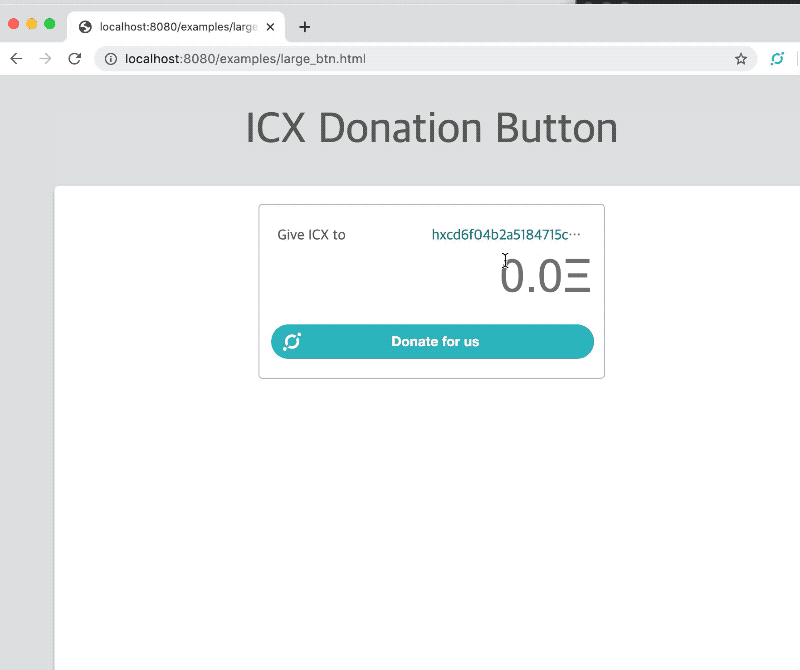
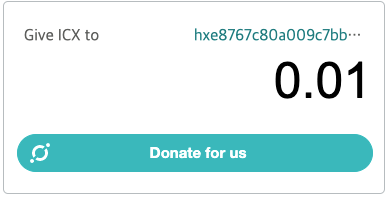
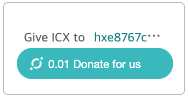

## icx-donate

[](http://icontrol.id)


A simple way to receive ICX donations.
Works with ICONex Chrome Extension. (https://chrome.google.com/webstore/detail/iconex/flpiciilemghbmfalicajoolhkkenfel)




## Usage

Just insert the tag below into your UI.
```html
<script
  src="https://icontrol-team.github.io/icx-donate/dist/icx-donate-button.js"
  data-meta="icx-donate"
  address="{YOUR ICX ADDRESS}">
</script>

```

Options

        
|Options| Description|default value|
|---|---|---|
|address| your icx address| None|
|network| Network name | mainnet `(mainnet, euljiro, yeouido, pagoda)`|         
|button-type| button type| default `(default, simple)`|
|amount| Set the amount of icx to be donated.| `float`|
|button-string| Set the button string.| Donate for us|
|debug| print debug message using console.log | None|


#### example #1



```html
<script
  src="https://icontrol-team.github.io/icx-donate/dist/icx-donate-button.js"
  data-meta="icx-donate"
  address="hxe8767c80a009c7bb8344d81c430144463cbb325e"
  amout="0.01"
  >
</script>

```


#### example #2



```html
<script
  src="https://icontrol-team.github.io/icx-donate/dist/icx-donate-button.js"
  data-meta="icx-donate"
  address="hxe8767c80a009c7bb8344d81c430144463cbb325e"
  amout="0.01"
  debug>
</script>

```


## How to build

`npm install`
`npm webpack`
`npm run dev`


To build the code, run npm run webpack. This will write a new version to dist/icx-donate-button.js.


